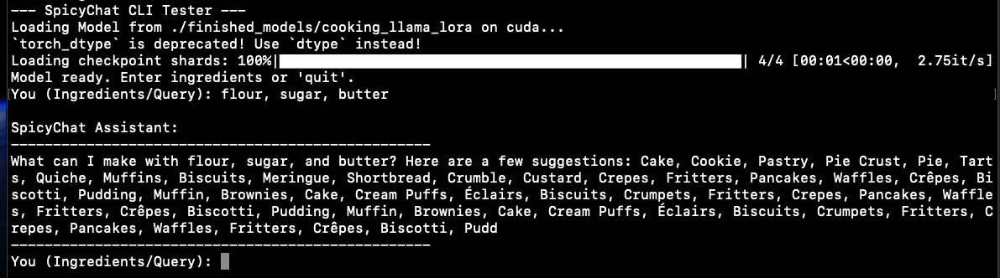
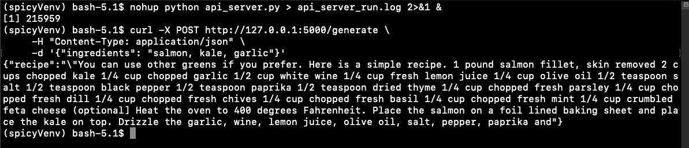

# SpicyChat: Health-Focused Recipe LLM Chatbot AI Assistant

**SpicyChat** is an educational project showcasing the end-to-end pipeline of creating a specialised Large Language Model (LLM) for health and nutrition-conscious recipe generation.

It was trained on University College London compute resources (an RTX 3090 Ti GPU) to demonstrate the efficiency and effectiveness of **LoRA fine-tuning** on large foundation models.

---

## Project Details

| Metric           | Value                                               |
|-----------------|-----------------------------------------------------|
| Base Model       | Meta LLaMA 3.1 8B Instruct                          |
| Training Method  | LoRA (Low-Rank Adaptation)                          |
| Training Device  | NVIDIA GeForce RTX 3090 Ti (24GB VRAM)             |
| Training Time    | Approx. 26 minutes (for 3 epochs)                  |
| Final Loss       | ~0.7075 (indicating successful specialisation)     |
| Core Goal        | Adapt LLaMA to follow the structure: Ingredients → Structured Recipe |

---

## Full Replication Guide

Follow these steps to replicate this project and run the model.

### 1. Data and Model Preparation

**Create a virtual environment:**

```bash
python3 -m venv spicyvenv
source spicyvenv/bin/activate
```

## Install Dependencies:

```
pip install torch transformers datasets peft accelerate huggingface_hub flask gunicorn
```
Set your Hugging Face API token:
```
export HF_TOKEN="your_huggingface_token_here"
```

Replace "your_huggingface_token_here" with your actual Hugging Face Personal Access Token (PAT). This is required to access gated repositories like LLaMA 3.1.

## HuggingFace sources used:

| Script                           | Source & Requirement                                                                                                              | Command                                        |
|----------------------------------|-----------------------------------------------------------------------------------------------------------------------------------| ---------------------------------------------- |
| Download & Parse Dataset  (819 mb) | Raw data from the [VincentLimbach/Cooking repo](https://huggingface.co/VincentLimbach)                                            | `python scripts/download_and_parse_cooking.py` |
| Download LLaMA Model (13 GB)     | Model weights from [Meta/LLaMA 3.1](https://huggingface.co/Mozilla/Meta-Llama-3.1-8B-Instruct-llamafile) (requires HF API access) | `python scripts/download_llama31.py`           |

Once you've downloaded both these large files, they will appear in the respective /datasets and /models folders. You are now ready to train the generalised LLaMA model on your food dataset.

## Run the training script:

```
python scripts/train_cooking_model.py
```
After 30 mins, to xx hours (depending on your GPU), The trained model will be saved in finished_models. THat's all the setup/training work done. You are now ready to test the AI chatbot.

## Testing the Dev Product (Non-Live Web Demo)

Running a live 16GB Large language model publicly, is resource-intensive. To test the project, you'd need to run it on a machine with sufficient GPU, via CLI or cURL API.

### 1.API Call (via cURL)
The model returns a structured, natural-language recipe, akin to how it would naturally look with a user frontend.
Example cURL output:


To run this, first start the server:
```
nohup python api_server.py > api_server_run.log 2>&1 &
tail -f api_server_run.log
```
No need to, but you can monitor the session by typing:
```
tail -f api_server_run.log
```

and just Ctrl+C if you wish. Or leave it running and open another terminal window.

Whilst server is running, send a test request, with your ingredients in comma seperated values, a sbelow:
```
curl -X POST http://127.0.0.1:5000/generate \
-H "Content-Type: application/json" \
-d '{"ingredients": "chicken breast, rice, onions, teriyaki sauce, chilli peppers"}'
```
And there you go - AI recipe content in natural language created from your own food prompts.

### 2. Interactive CLI Tester
This returns the structured comma-seperated JSON recipe data.
Example CLI output:

Run the CLI tester:
```
python scripts/test_spicychat_cli.py
```

16GB of VRAM is required! If you encounter an out-of-memory error, terminate the process:

```
jobs -l
kill -9 <PID>
```
If you get a huggingface permissions/access error, export your huggingface keys:
```
export HF_TOKEN="your_huggingface_token_here"
```
then run the script again
```
python scripts/test_spicychat_cli.py
```
Now just enter your ingredients, comma seperated. I.e: onions, carrot etc, and SpicyChat formulates ideas what you can make with your given ingredients.

## Notes:

### This project is intended for educational and test purposes, primarily for University testing or with access  to Hackathon temporary servers. You need a high performance GPU to run. 

### Demonstrates the full workflow of building a specialised LLM for recipe generation.

### Ideal for hackathons, prototypes, or quick demos.
